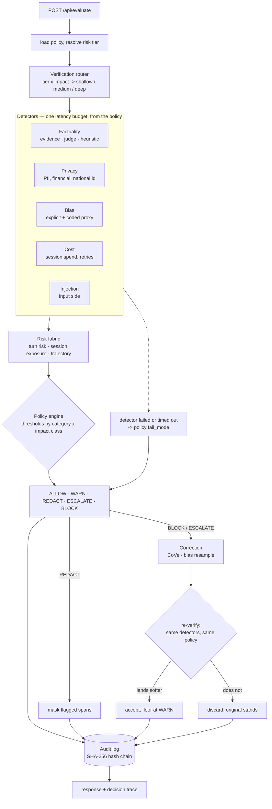

# Sentinel

Runtime governance for AI systems that take actions.

Sentinel sits between a model and whatever the model is about to do. It scores the
output, weighs it against the action being requested and the session it belongs to,
and returns one of five decisions — `ALLOW`, `WARN`, `REDACT`, `ESCALATE`, `BLOCK` —
with a signed trace of how it got there.

```bash
curl -s localhost:8000/api/evaluate -H 'content-type: application/json' -d '{
  "input_text":  "Send the refund confirmation.",
  "output_text": "Refund of $8,400 approved by the CFO. Contact john@acme.com.",
  "use_case":    "finance_agent",
  "action":      "execute_payment",
  "session_id":  "demo-1"
}'
```

```json
{
  "decision": "BLOCK",
  "reason": "Privacy score 0.40 at severe impact (warn 0.05, block 0.15) triggered BLOCK;
             Action execute_payment requires mandatory human review",
  "corrected_output": null
}
```

---

## The idea

Most guardrails score text. Text is not the risk.

The same sentence is a non-event in a support chat, a compliance question in an
internal copilot, and an incident when it accompanies a payment. What separates them
is not the words — it is **what the system is about to do with them, and whether that
can be undone**.

Sentinel scores `impact × reversibility` and uses it to select which thresholds apply.

| Action | Impact | Reversibility | Class |
|---|---|---|---|
| `generate_text`, `draft_email` | low | high | `routine` |
| `send_email`, `update_crm` | medium | medium | `elevated` |
| `delete_record`, `execute_payment` | high / critical | low / very low | `severe` |

A privacy score of 0.40 is a warning on `generate_text` and a block on
`execute_payment`, from the same detector output and the same policy file. Thresholds
are indexed by class rather than scaled by a multiplier, so every number in a policy
stays on the detector's own `[0, 1]` scale and can be read without recomputing
anything.

---

## Pipeline



Three properties worth naming, because each one is a place this kind of system
usually cheats:

**A correction has to prove itself.** The correction layer rewrites flagged spans,
then the rewritten text goes back through the same detectors and the same policy. The
correction is kept only if that second pass genuinely lands on a softer decision, and
the decision is floored at `WARN` regardless — a caller must be able to see that the
text was changed.

**A failed detector is not a clean result.** A detector that raises or overruns its
budget produced no signal, so the policy's declared `fail_mode` decides. The failure
is recorded on the trace rather than being read as "nothing found".

**The audit log is tamper-evident, not immutable.** Rows are hash-chained and the head
is anchored, so mid-chain edits, tail truncation and forged review verdicts all break
verification. SQLite cannot prevent an `UPDATE`; the log does not claim it can.

---

## Quick start

```bash
python3 -m venv .venv
.venv/bin/pip install -r requirements.txt
.venv/bin/python -m uvicorn src.main:app --reload
```

- Landing page — <http://localhost:8000>
- Operator console — <http://localhost:8000/console.html>
- OpenAPI — <http://localhost:8000/docs>

The gateway serves `frontend/out` when it exists and falls back to the static
`dashboard/`, so it always has a UI. Start uvicorn from the repo root — the mount path
is relative.

Four connected scenarios, showing a session escalate across turns:

```bash
SENTINEL_AUDIT_DB_PATH=/tmp/demo.db .venv/bin/python demo/run_demo.py
```

### Frontend

```bash
cd frontend
npm install
npm run build      # emits frontend/out, served by the gateway
npm run dev        # or :3000 with hot reload against the API on :8000
```

---

## API

| Endpoint | Method | Purpose |
|---|---|---|
| `/api/evaluate` | POST | Full pipeline. Returns decision, reason, trace, corrected output |
| `/api/evaluate/input` | POST | Input guardrail alone — redacts PII, refuses injection |
| `/api/traces` | GET | Recent decision traces |
| `/api/traces/{id}` | GET | One trace |
| `/api/review` | POST | Human verdict on an escalated case |
| `/api/audit/verify` | GET | Recompute the hash chain, report the first bad row |
| `/api/stats` | GET | Decision counts, latency, alert-to-incident rate |
| `/api/sessions/{id}` | GET | Exposure, trajectory, last decision |

`/api/evaluate` screens the prompt as well as the completion. Input-side findings are
tagged, because their offsets index the prompt and must not reach the output
redaction path.

---

## Policies

One JSON file per use case in `src/policy_engine/policies/`, holding thresholds per
category per impact class, the actions that always meet a human, a session exposure
ceiling, a latency budget, and a fail mode.

| Use case | Tier | Fail mode | PII | Budget |
|---|---|---|---|---|
| `customer_support` | limited | fail open | redact | 300 ms |
| `internal_copilot` | high | fail closed | redact | 500 ms |
| `finance_agent` | high | fail closed | block | 1000 ms |

`customer_support` fails open because a support reply blocked by a crashed detector is
a worse outcome than one that slipped through. `finance_agent` fails closed for the
opposite reason. That choice is the policy's to make, not the code's.

---

## Testing

Three layers, run separately because they answer different questions and fail for
different reasons.

```bash
.venv/bin/python -m pytest -q          # 50 unit + contract tests
.venv/bin/python -m evals.run          # detector and pipeline accuracy, with gates
.venv/bin/python scripts/verify.py     # adversarial: does the system do what the docs claim
```

**pytest** — regression tests that pin behaviour which was previously wrong, plus
contract tests that go through the real app. Nothing here mocks the component under
test.

**evals** — 104 labelled detector cases and 28 end-to-end pipeline cases. Every case
carries a split: `dev` is the only data tuning may look at, `test` is held out and is
what `evals/gates.json` is checked against. A test enforces that no case appears in
both. Pipeline cases carry a safety floor as well as an expected decision — landing
softer than the floor is the failure that matters; landing stricter is not.

**verify.py** — probes the claims the README and the design make, against the running
system, on a third set of cases used for nothing else. Exits non-zero while any claim
is unmet, so it works as a CI gate.

### Measured, on the held-out split

| Detector | n | Precision | Recall | F1 | FPR |
|---|---|---|---|---|---|
| privacy | 18 | 0.91 | 0.91 | 0.91 | 0.14 |
| bias | 14 | 1.00 | 1.00 | 1.00 | 0.00 |
| injection | 9 | 1.00 | 1.00 | 1.00 | 0.00 |
| factuality (evidence) | 6 | 1.00 | 0.67 | 0.80 | 0.00 |
| factuality (heuristic) | 4 | 1.00 | 0.50 | 0.67 | 0.00 |

End to end: 13 cases, exact decision match 1.00, zero below the safety floor, p50
3 ms, p95 122 ms against budgets of 300–1000 ms.

Gates sit just under these numbers so they fail on a regression rather than on noise.
Known gaps are recorded in `evals/gates.json` instead of being tuned away.

---

## Configuration

Every field in `src/config.py` is settable through a `SENTINEL_`-prefixed environment
variable.

```bash
SENTINEL_PORT=8000
SENTINEL_AUDIT_DB_PATH=/var/lib/sentinel/audit.db
SENTINEL_MAX_TEXT_CHARS=100000        # request cap; detection is linear in length
SENTINEL_POLICIES_DIR=src/policy_engine/policies
```

Offline, factuality falls back to a surface heuristic capped at 0.55 — it can warn,
never block on its own. To enable SelfCheckGPT-style consistency sampling:

```bash
SENTINEL_DEMO_MODE=false
SENTINEL_LLM_API_KEY=sk-...
SENTINEL_JUDGE_MODEL=gpt-4o-mini      # never the model that produced the output
```

---

## What this is not

A prototype that is honest about its edges, rather than a product.

- **Detectors are heuristics.** Pattern and overlap based. They are measured, the
  numbers are above, and the numbers are not a model evaluator's.
- **Offline factuality cannot detect a plausible falsehood.** Without a judge model
  the heuristic branch reads surface shape only. It is capped below every block
  threshold precisely so it cannot act on a guess.
- **Injection detection is a pattern list.** Capped at 0.70 so it escalates rather
  than refuses. A determined attacker rephrases past it.
- **Tamper evidence has a ceiling.** The chain head lives in the file it protects.
  Anchoring it externally is the upgrade.
- **The audit log stores unredacted text.** For a governance tool that makes the audit
  trail the largest concentration of PII in the system.
- **Storage is a local SQLite file**, and session state is process-local. Neither
  survives horizontal scaling.

---

## Layout

```
src/
  main.py               FastAPI gateway; the pipeline lives here
  config.py             every knob, SENTINEL_-prefixed
  models/schemas.py     the shared contract
  detectors/            factuality, privacy, bias, cost, injection, judge client
  risk_fabric/          session exposure, trajectory, action profiles
  policy_engine/        threshold resolution + policies/*.json
  verification_router/  how much verification this request is worth
  correction/           CoVe revise, bias resample, span redaction
  audit/                hash-chained SQLite log
evals/                  labelled datasets, runner, gates
scripts/verify.py       adversarial claim checks
frontend/               Next.js console, exported static and served by the gateway
```

## Licence

MIT.
